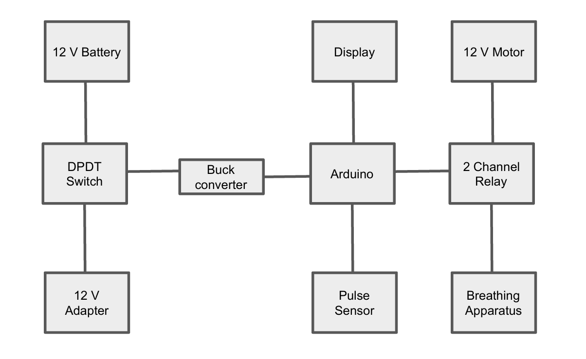
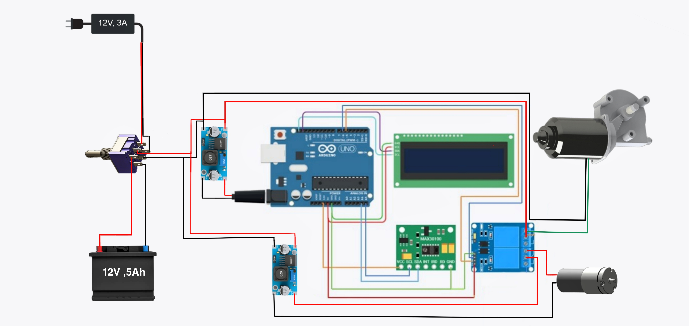

# Electro-Mechanical CPR Device 💓🤖

An **Arduino-based electro-mechanical CPR (CardioPulmonary Resuscitation) device** developed as part of our **B.Tech project** in Electrical & Electronics Engineering at **Vidya Academy of Science & Technology**.

## 📌 Overview
Manual CPR is often inconsistent due to fatigue and improper technique. Our project introduces an **automated, low-cost, and portable CPR device** that provides:
- Consistent chest compressions
- Integrated ventilation system
- Real-time pulse & oxygen monitoring (SpO2, BPM)

This project aims to provide an **affordable alternative** to expensive commercial CPR devices while improving survival chances during cardiac arrest.

---

## 🚀 Features
- ✅ **Automated chest compressions** using DC geared motor
- ✅ **Pulse and SpO₂ monitoring** via MAX30100 sensor
- ✅ **Arduino-controlled system** with customizable compression rate & depth
- ✅ **LCD display** for real-time vitals
- ✅ **Cost-effective design** compared to existing medical devices

---

## 🔧 Hardware Components
- Arduino UNO R3
- MAX30100 Pulse Oximeter & Heart Rate Sensor
- 16x2 I2C LCD Display
- 12V 150 RPM DC Geared Motor
- Oxygen Supply & Breathing Apparatus
- Power Supply: 12V 7Ah Battery
- Jumper Wires & Connectors

---

## ⚡ Circuit & Block Diagram
- 
- 

---

## 🖥️ Software
Arduino sketch for device control and pulse oximeter readings:

- Located in [`/code/cpr_device.ino`](code/cpr_device.ino)

### Key Libraries:
- `LiquidCrystal_I2C.h`
- `Wire.h`
- `MAX30100_PulseOximeter.h`

---

## 📊 Methodology
1. **Position the device** on patient’s chest (aligned with sternum).
2. **Activate system** to deliver chest compressions + ventilation.
3. **Monitor vitals** on LCD (BPM, SpO₂).
4. **Continue CPR** until patient pulse stabilizes or advanced support arrives.

---

## 📷 Results
- Device successfully measured BPM & SpO₂.
- Automated compression & ventilation mechanism demonstrated.
- Achieved **cost-effective working prototype**.

---

## 🔮 Future Scope
- Improve mechanical design for portability
- Wireless monitoring via mobile app
- Integration with defibrillator systems
- Clinical trials & optimization

---

## 👨‍💻 Contributors
- Nikhil M B  
- Prince Suresh V S  
- Yedhukrishna K S  
- Krishnaprasad K A  

